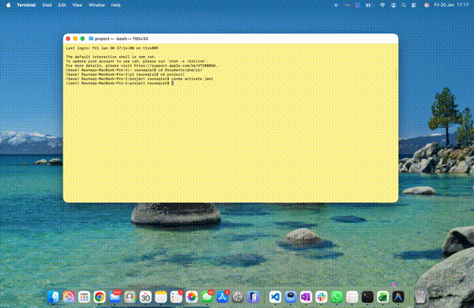

# redshift_slider

Interactive redshift fitting tool with visual emission line markers.

## Demo



## Installation

```bash
# From the package directory
pip install -e .
```

## Quick Start

```python
from redshift_slider import RedshiftSlider

# Load your spectrum (observed wavelength in Angstroms)
# wavelength, flux = ... your data ...

# Create the slider
slider = RedshiftSlider(
    wavelength, 
    flux,
    flux_err=flux_err,   # optional
    z_prior=2.5,         # your initial redshift guess
    msaid='12345',       # object identifier
    save_file='fitted_redshifts.txt'  # where to save results
)

# Show the interactive plot
z_fitted = slider.show()
```

## Batch Processing

Process multiple spectra in one go:

```python
from redshift_slider import batch_fit

results = batch_fit(
    wavelengths=[wl1, wl2, wl3],
    fluxes=[fl1, fl2, fl3],
    z_priors=[2.5, 3.1, 1.8],
    msaids=['obj1', 'obj2', 'obj3'],
    save_file='fitted_redshifts.txt'
)
```

## Features

- **Interactive slider** to adjust redshift and see where emission lines would fall
- **Zoom panels** around key emission lines (Lyα, CIV, CIII], Hβ, [OIII], Hα)
- **Auto-save** - redshifts saved automatically when pressing Next ✓ or Enter
- **Keyboard navigation** for precise adjustments
- **Color-coded lines** by type (UV, Balmer, [OIII], etc.)
- **Step-style spectra** in zoom panels to show spectral bins clearly

## Controls

### Buttons

| Button | Function |
|--------|----------|
| Reset | Return to z_prior |
| Wider | Double the slider range |
| Next ✓ | Auto-save and move to next spectrum |
| Skip | Skip without saving (batch mode only) |

### Keyboard Shortcuts

| Key | Action |
|-----|--------|
| ← / → | Adjust z by ±0.0005 |
| Shift + ← / → | Fine adjust z by ±0.0001 |
| Enter | Save and move to next spectrum |

## Output File Format

The save file (`fitted_redshifts.txt`) contains:
```
# msaid          z_prior       z_fitted      delta_z
demo_12345       1.98000       2.00123       +0.02123
```

## Parameters

| Parameter | Default | Description |
|-----------|---------|-------------|
| `wavelength` | required | Observed wavelength array (Å) |
| `flux` | required | Flux array |
| `flux_err` | None | Flux error array |
| `z_prior` | 0.0 | Initial redshift guess |
| `delta_z` | 0.05 | Slider range: z_prior ± delta_z |
| `msaid` | 'unknown' | Object identifier |
| `save_file` | 'fitted_redshifts.txt' | Output file path |
| `zoom_width_A` | 80 | Zoom panel width (rest-frame Å) |

## Custom Lines

```python
# Use only specific lines
my_lines = {
    'Hα': 6562.82,
    '[OIII]5007': 5006.84,
    'Hβ': 4861.33,
}
slider = RedshiftSlider(wavelength, flux, z_prior=2.0, lines=my_lines)
```

## Run Demo

```bash
redshift-slider-demo
```

Or in Python:
```python
from redshift_slider.core import main
main()
```
